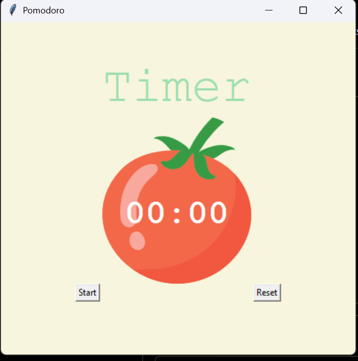

# 🍅 Tkinter GUI-Based Pomodoro Timer

A simple and visually appealing **Pomodoro Timer** desktop application built with Python and Tkinter, designed to boost productivity using focused work sessions and short breaks.

---

## 📸 Preview



> A tomato-themed timer interface with start and reset controls.

---

## 📁 Project Structure

```
Tkinter-GUI-Based-POMODORO-Timer/
│
├── images/              # App screenshots and assets
├── main.py              # Main application script
├── tomato.png           # Tomato image used in the GUI
└── LICENSE              # MIT License
```

---

## ✨ Features

- 🍅 **Tomato-themed GUI** — charming tomato canvas with timer text overlaid at the center
- ⏱️ **Countdown Timer** — displays time in `MM:SS` format on the tomato graphic
- ▶️ **Start Button** — begins the Pomodoro session and auto-cycles through work/break rounds
- 🔄 **Reset Button** — cancels the timer and resets everything to the initial state
- 🟢 **Work / Break Labels** — title dynamically changes color to indicate the current session type
- ✔️ **Progress Checkmarks** — a `✔` is added below the timer for every completed work session
- 🔁 **Auto-cycling** — automatically moves between work and break sessions without user input
- 🖥️ **Lightweight** — uses only Python's built-in `tkinter` and `math` libraries

---

## ⏰ Session Timing

| Session | Duration | Trigger |
|---------|----------|---------|
| 🟢 Work | 1 minute* | Odd reps (1st, 3rd, 5th, 7th) |
| 🩷 Short Break | 5 minutes | Even reps (2nd, 4th, 6th) |
| 🔴 Long Break | 20 minutes | Every 8th rep |

> \* `WORK_MIN = 1` is set for testing. Change it to `25` in `main.py` for a standard Pomodoro session.

---

## 🛠️ Tech Stack

| Technology | Purpose |
|------------|---------|
| Python 3.x | Core programming language |
| Tkinter    | GUI framework (built-in) |
| math       | Minute/second calculation (built-in) |

---

## 🚀 Getting Started

### Prerequisites

- Python 3.x installed on your system
- No external libraries required — only built-in modules used

### Installation

1. **Clone the repository:**

   ```bash
   git clone https://github.com/Curio369/Tkinter-GUI-Based-POMODORO-Timer.git
   cd Tkinter-GUI-Based-POMODORO-Timer
   ```

2. **Run the application:**

   ```bash
   python main.py
   ```

> Make sure `tomato.png` is in the same directory as `main.py` before running.

---

## ⚙️ Configuration

You can customize the session durations by editing these constants at the top of `main.py`:

```python
WORK_MIN = 1          # Change to 25 for standard Pomodoro
SHORT_BREAK_MIN = 5   # Short break after each work session
LONG_BREAK_MIN = 20   # Long break after every 4 work sessions (8 reps)
```

---

## 🍅 What is the Pomodoro Technique?

The **Pomodoro Technique** is a time management method developed by Francesco Cirillo in the late 1980s. It breaks work into intervals separated by short breaks.

**How it works:**
1. Choose a task to work on
2. Set the timer for one Pomodoro (25 minutes)
3. Work until the timer rings
4. Take a short break (5 minutes)
5. After 4 Pomodoros, take a long break (15–30 minutes)

---

## 🖱️ Usage

| Button | Action |
|--------|--------|
| **Start** | Starts the countdown and auto-cycles sessions |
| **Reset** | Cancels the timer, clears checkmarks, resets to `00:00` |

---

## 📄 License

This project is licensed under the **MIT License** — see the [LICENSE](LICENSE) file for details.

---

## Learned from
**Angla Yu Tutorials**


GitHub: [@Curio369](https://github.com/Curio369)

---

> *"The secret of getting ahead is getting started."* — Mark Twain 🍅
